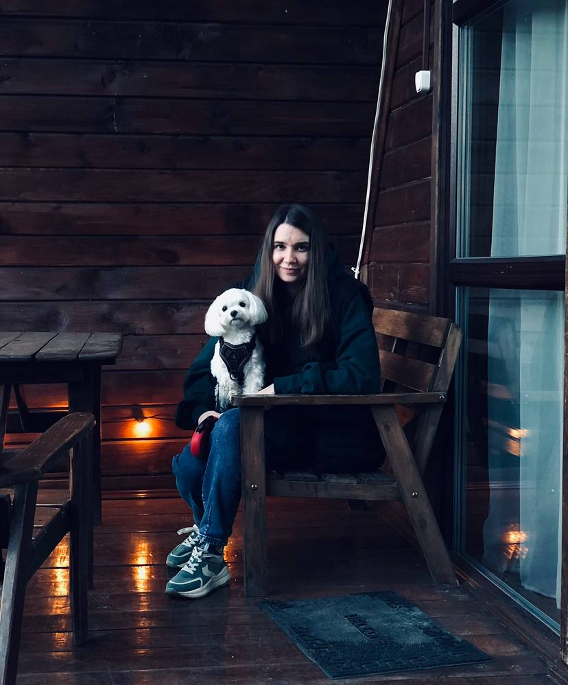

# Привет!  
Меня зовут **Алена Нехлюдова**  

---

## Обо мне
- Образование: Московский городской педагогический университет, специальность — учитель  
- Интересуюсь веб-разработкой и планирую развиваться в сфере IT  
- Живу в Туле  
- Цель: создать портфолио и развиваться через практические проекты  

---

## Интересы
- Изучение HTML, CSS и основ JavaScript  
- Современные веб-технологии и лучшие практики разработки  
- Проектирование удобных и понятных интерфейсов  
- Постепенное создание собственных проектов и работа с GitHub  

---

## Проекты
- [my-portfolio](https://alenanekhlyudova.github.io/my-portfolio/) — первый сайт, опубликованный с помощью GitHub Pages  

---

## Контакты
- Email: alenka.955@yandex.ru  
- Telegram: @Alena_Nekhlyudova